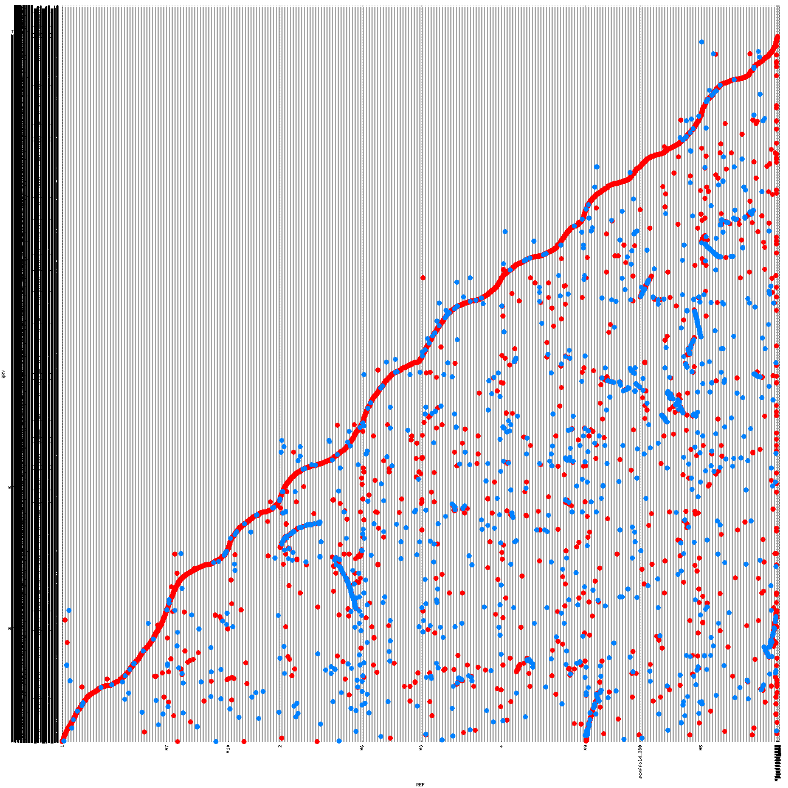
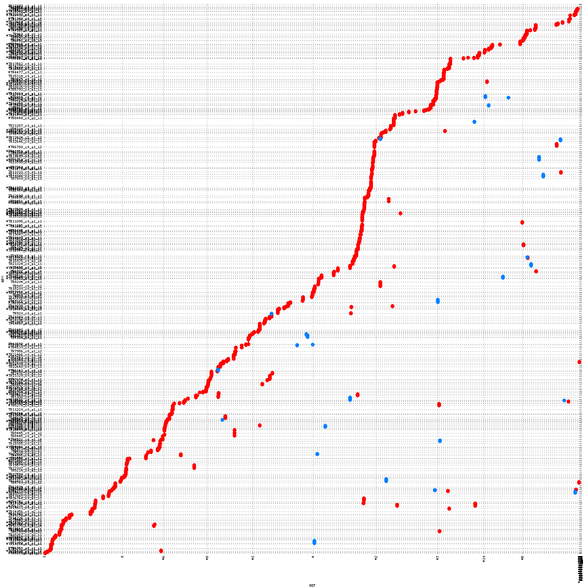
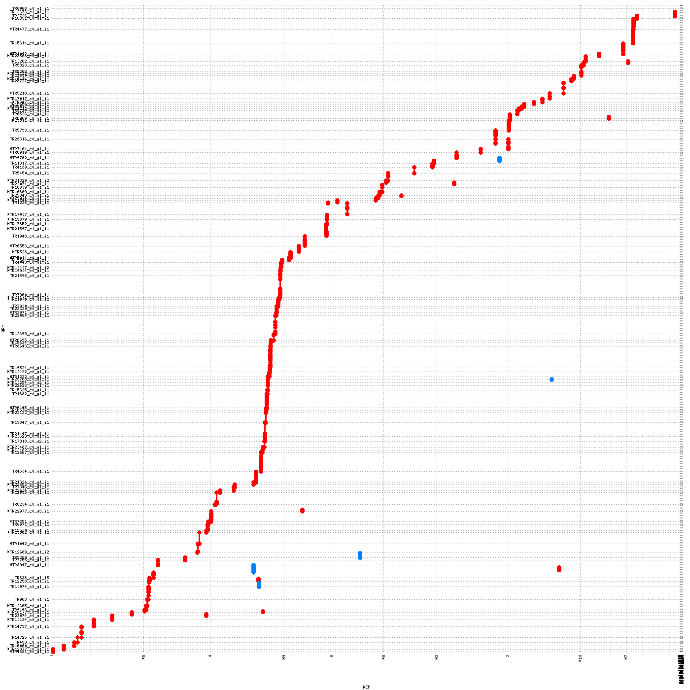
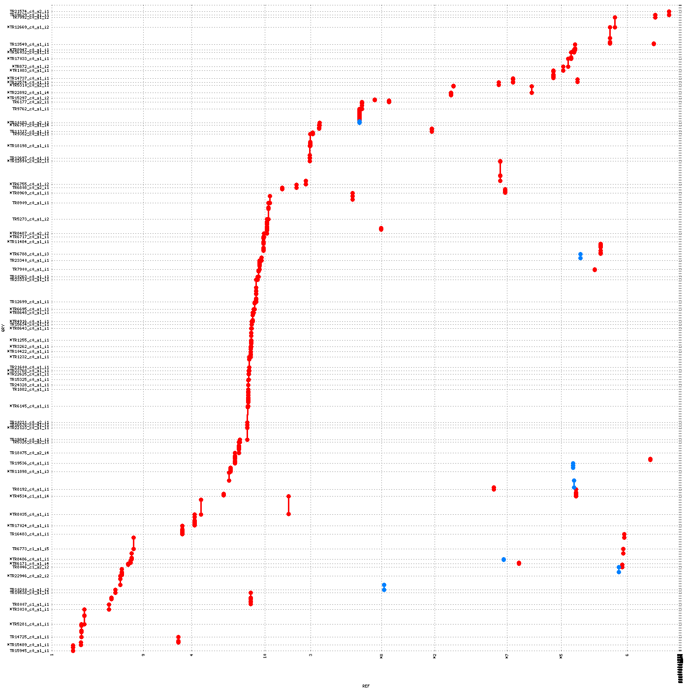
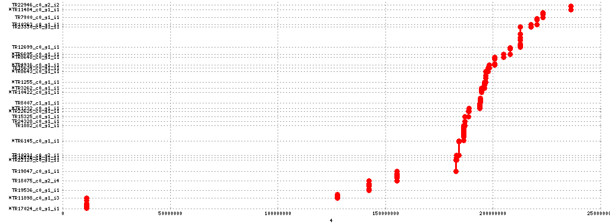

### Bulked RNA-seq data analysis using Maize ems data

RNA-seq data published from [Liu et al PlosOne 2012] (http://journals.plos.org/plosone/article?id=10.1371/journal.pone.0036406)
is used for the analysis.

RNA-seq data generated using bulks of maize *glossy* mutant and wildtype phenotyped plants.
A heterozygous plant resulting from a cross between gl3 in non-B73 bacground and an inbread B73 is used to self resulting in segrigating F2 population.

Mutation is recessive

The lower leaves of 32 mutants and 31 non-mutant siblings were collected made pools for sequencing.
The libraries were sequenced on an Illumina GA II resulting in 75 bp single end reads [GenBank accession no. SRA049037] (http://www.ncbi.nlm.nih.gov/sra/?term=SRP010139)

RNA-seq data is downloaded from SRA and quality checked using fastqc 

```
source sratoolkit-2.3.3.3; fastq-dump --gzip SRR396616.sra
source sratoolkit-2.3.3.3; fastq-dump --gzip SRR396617.sra
```

Fastqc reports of raw data is in the [fastqc_reports folder](./fastqc_reports)

[SRR396616](http://htmlpreview.github.io/?https://github.com/shyamrallapalli/mutations_hts_noref/blob/master/003_transcriptome_arrange/maize/fastqc_reports/SRR396616_fastqc.html)

[SRR396617](http://htmlpreview.github.io/?https://github.com/shyamrallapalli/mutations_hts_noref/blob/master/003_transcriptome_arrange/maize/fastqc_reports/SRR396617_fastqc.html)

Trimmomatic is used to quality filter reads for adapter and poor base qualities.

```
source trimmomatic-0.33; trimmomatic SE SRR396616.fastq.gz trim_SRR396616.fastq.gz ILLUMINACLIP:ilmn_adapters.fa:2:30:10 HEADCROP:13 LEADING:10 TRAILING:10 SLIDINGWINDOW:4:15 MINLEN:25
source trimmomatic-0.33; trimmomatic SE SRR396617.fastq.gz trim_SRR396617.fastq.gz ILLUMINACLIP:ilmn_adapters.fa:2:30:10 HEADCROP:13 LEADING:10 TRAILING:10 SLIDINGWINDOW:4:15 MINLEN:25
```

Fastqc reports of trimmomatic data is provided in [fastqc_reports folder](./fastqc_reports)

Trimmomatic quality filtered data is used to assemble transcriptome of maize using both bulk samples together.

Assembly carried out using both trinity (v 2.0.6) and soapdenovo-trans (v 1.03).

Assembly with trinity is done with single k-mer set at size 25
With soapdenovo-trans multiple kmer sizes of 25, 31, 41, 51 and 61 and assemblies are pooled from all kmer assemblies and removed any contig less than 100bp
[sample config](./sample.config) and [the shell script](./soap-trans_kmer_iter.sh) used to run soapdenovo are provided
Reduced redundancy using cd-hit-est program.
cd-hit-est was ran with sequence identity threshold (-c) of 0.95
Resulting sequences were further filtered by discarding sequences smaller than 200bp.
Scripts used are provided in [the lib folder] (../../lib/) of this repository

```
source trinity-2.0.6; Trinity --seqType fq --max_memory 50G --single trim_SRR396616.fastq.gz,trim_SRR396617.fastq.gz --CPU 64 --full_cleanup > assembly_log_trinity.txt

sh soap-trans_kmer_iter.sh
source ruby-2.0.0; ruby ~/lib/fasta_pooled_changename.rb contig 100 > combined_contigs.fa
source ruby-2.0.0; ruby ~/lib/read_write_fasta.rb 95.0_combined_contigs.fa 200 > maize_sel_cdhit_combined_soap_contigs.fa

```
Assembly log for trinity is [available here](./maize_assembly_log_trinity.txt)  
Number of sequences assembled by Trinity default params: 33563

Default params trinity assembly is [available here](http://www.mediafire.com/download/zfcto6xteknz9jj/maize_trinity_out.fa.gz)

Number of sequences in cdhit reduced (identity threshold - 0.975): 29288

Cd-hit reduced trinity assembly is [available here](http://www.mediafire.com/download/7r1198ntacpo8cz/maize_cdhit_97.5_trinity_out.fa.gz)

Number of contigs from soapdenovo-trans from all kmers pooled: 240601

| assembly kmers     | number |
|--------------------|--------|
| assembly_25.contig | 121236 |
| assembly_31.contig | 79952  |
| assembly_41.contig | 32425  |
| assembly_51.contig | 6968   |
| assembly_61.contig | 20     |

pooled sequecnes >=100bp: 174915  
combined contig assembly is [available here](http://www.mediafire.com/download/3ccyyi567jaiau9/maize_combined_soap_contigs.fa.gz)

cdhit reduced contigs at 0.95 identity threshold: 79358  
sequences selected >= 200bp: 29505

Combined and cdhit reduced  assembly is [available here](http://www.mediafire.com/download/1nmzv8y1wvq96mh/maize_sel_cdhit_combined_soap_contigs.fa.gz)

```
md5sums of the assembly archives
10bffdf9c0df6210e11b976a0e91bfa4  maize_trinity_out.fa.gz
3ef761d9ce21937438bda238b4463e42  maize_cdhit_97.5_trinity_out.fa.gz
a24eb7a33871aa5fc250be481dfb15b2  maize_combined_soap_contigs.fa.gz
67ff944b5b18824b20e6007ed9850963  maize_sel_cdhit_combined_soap_contigs.fa.gz
```
Assemblies of Trinity and soapdenovo-trans was compared along with cd-hit-est reduced trinity assembly using detonate software (v1.8.1).

```
source detonate-1.8.1; rsem-eval-calculate-score -p 32 trim_SRR396617.fq,trim_SRR396616.fq trinity_out_dir.Trinity.fasta assembly_trinity 60 &> log_trinity_assembly.txt
source detonate-1.8.1; rsem-eval-calculate-score -p 32 trim_SRR396617.fq,trim_SRR396616.fq 97.5_trinity_out_dir.Trinity.fasta assembly_cdhit_trin 60 &> log_assembly_cdhit_trin.txt
source detonate-1.8.1; rsem-eval-calculate-score -p 32 trim_SRR396617.fq,trim_SRR396616.fq sel_cdhit_combined_contigs.fa assembly_soap 60 &> log_soap_assembly.txt
```

trinity assembly default params score

```
Score   -647646690.57
BIC_penalty     -283004.92
Prior_score_on_contig_lengths   -283895.69
Prior_score_on_contig_sequences -27964329.85
Data_likelihood_in_log_space_without_correction -619258263.77
Correction_term -142803.65
Number_of_contigs       33563
Expected_number_of_aligned_reads_given_the_data 17839700.86
Number_of_contigs_smaller_than_expected_read/fragment_length    0
Number_of_contigs_with_no_read_aligned_to       115
Maximum_data_likelihood_in_log_space    -619150878.48
Number_of_alignable_reads       18095936
Number_of_alignments_in_total   28593577
Transcript_length_distribution_related_factors  -193190.28
```


trinity cdhit reduced assembly score

```
Score   -649246969.54
BIC_penalty     -246958.97
Prior_score_on_contig_lengths   -231053.68
Prior_score_on_contig_sequences -23939391.92
Data_likelihood_in_log_space_without_correction -624927918.38
Correction_term -98353.41
Number_of_contigs       29288
Expected_number_of_aligned_reads_given_the_data 17779048.32
Number_of_contigs_smaller_than_expected_read/fragment_length    0
Number_of_contigs_with_no_read_aligned_to       43
Maximum_data_likelihood_in_log_space    -624821893.47
Number_of_alignable_reads       18046487
Number_of_alignments_in_total   23344722
Transcript_length_distribution_related_factors  -174424.07
```

soapdenovo-trans assembly score

```
Score   -698053392.88
BIC_penalty     -248788.67
Prior_score_on_contig_lengths   -225240.88
Prior_score_on_contig_sequences -17817678.21
Data_likelihood_in_log_space_without_correction -679835760.71
Correction_term -74075.60
Number_of_contigs       29505
Expected_number_of_aligned_reads_given_the_data 16519932.99
Number_of_contigs_smaller_than_expected_read/fragment_length    0
Number_of_contigs_with_no_read_aligned_to       56
Maximum_data_likelihood_in_log_space    -679598364.13
Number_of_alignable_reads       16755935
Number_of_alignments_in_total   23624962
Transcript_length_distribution_related_factors  -182853.49
```


From the detonate score, Tinirty default assembly ranked higher, with cdhit reduced trinity assembly standing next and sopadenovo-trans ranked last.
Trinity cdhit reduced assmbly was taken for down stream analysis as the number of contigs with out any reads are lower and the number of total alignmetns are very close and the scores as well as very close.


Trimmomatic quality filtered reads used for variant calling
[Rakefile](./Rakefile_maize) is used call variants using bwa, samtools and varcan softwares

```
source ruby-2.0.0; rake bwa:all ref=97.5_trinity_out_dir.Trinity.fasta r1=trim_SRR396616.fastq.gz dir=maize_mutant &> log_maize_mutant.txt
source ruby-2.0.0; rake bwa:all ref=97.5_trinity_out_dir.Trinity.fasta r1=trim_SRR396617.fastq.gz dir=maize_wt &> log_maize_wt.txt
```


Resulting variant files were used to generate filtered variant files for sdm selection of fragments with causative mutation.

Fragments selected from sdm are written to a file

```
source ruby-2.0.0; ruby filter_vcf_background.rb mutant_maize_vars.vcf wildtype_maize_vars.vcf
source ruby-2.0.0; xvfb-run ruby ~/fastqc_reports/wheat_data/variants/homeosplit/SNP_distribution_method/implement_sdm.rb .
source ruby-2.0.0; ruby ~/lib/read_write_fasta_filter.rb sdm_log_0_0.5/4_5_selected_frags.txt sel_trinity_cdhit97.5.fa > chosen_sel_trinity_cdhit97.5.fa
```

sdm analysis is provided in the [following folder](./sdm_analysis)

Then attempted to display the transcripts assembled and transcripts selected from sdm on the genome.
Used mummer to do this

First depicted assembled trancripts on the genome of maize

```
source mummer-3.23_64bit; nucmer --prefix=ref_transcripts zea_mays.AGPv3.22.dna.genome.fa sel_trinity_cdhit97.5.fa
source mummer-3.23_64bit; delta-filter -q -r ref_transcripts.delta > ref_transcripts.filter
source mummer-3.23_64bit; mummerplot ref_transcripts.filter -f -l --large --png -R zea_mays.AGPv3.22.dna.genome.fa -Q sel_trinity_cdhit97.5.fa
```

resulting image displaying maize choromosomes on X-axis and 29288 assembled transcripts on Y-axis




Next depicted selected transcript resulting from sdm (N=298)

```
source mummer-3.23_64bit; nucmer --prefix=ref_selcted zea_mays.AGPv3.22.dna.genome.fa chosen_sel_trinity_cdhit97.5.fa
source mummer-3.23_64bit; delta-filter -q -r ref_selcted.delta > ref_selcted.filter
source mummer-3.23_64bit; mummerplot ref_selcted.filter -f -l --large --png -R zea_mays.AGPv3.22.dna.genome.fa -Q chosen_sel_trinity_cdhit97.5.fa
```




One can clearly see that there is enriched transcript alignment to second half of chromosome 4 compared to rest of the genome

Liu et al have indeed found that causative mutation is harboured on distal end of chromosome 4. [See Figure 1D in published manuscript] (http://journals.plos.org/plosone/article?id=10.1371/journal.pone.0036406#s2)


Improvements of mutation picking:

For the initial analysis only vcf files were used along with bam file from the mutant.
To improve on the calling of positions hosting candidate mutation, both bam files of mutant and background are made use to ignore positions with more than expected frequency of 33% in the background bam.
For a recessive mutation, the background pool constitutes heterozygotes and homozygotes of wildtype.
This results in a frequency of mutation base around 0.33. 
So ignored positions with variant frequency > 0.35.

This step resulted in selection of fragments with possible mutation to 115, which is about 1/3rd of initially selected fragments

Mummer was used to depict against chromosomes and the image is as follows





sdm method further improved by making use of variant comparison between mutant and background by using pileup files instead of vcf files.
Pileup file comparison is essential, especially for polyploid genomes.
This change has further reduced the number of fragments with variants for maize data
Number of fragments with variants are now 80 and Mummer was used to depict against chromosomes and the image is as follows




And futher plotting only transcripts on chromosome 4 shows that majority of the transcript selected are at the distal end of chromosome as found in the manuscript [See Figure 1D in published manuscript] (http://journals.plos.org/plosone/article?id=10.1371/journal.pone.0036406#s2).

